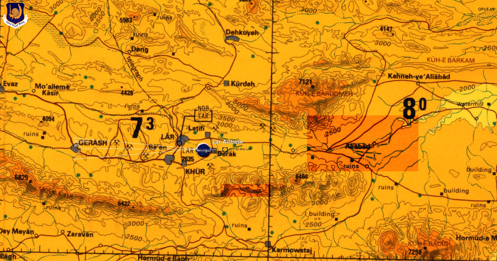
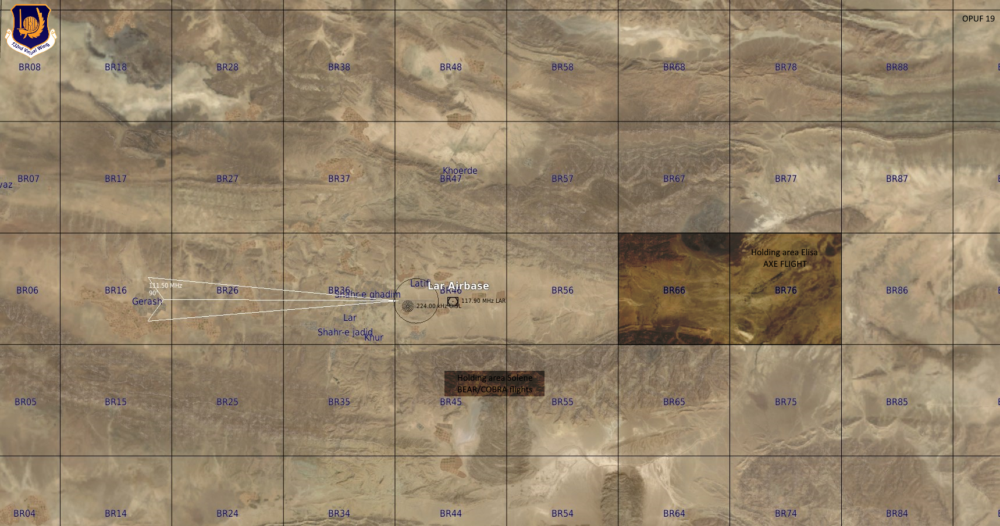
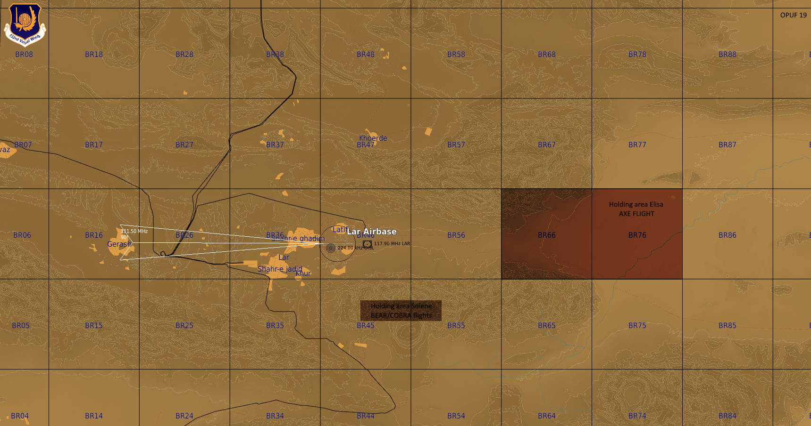
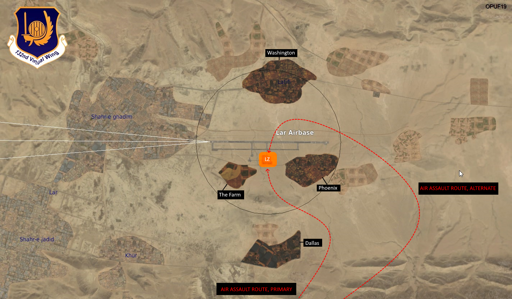
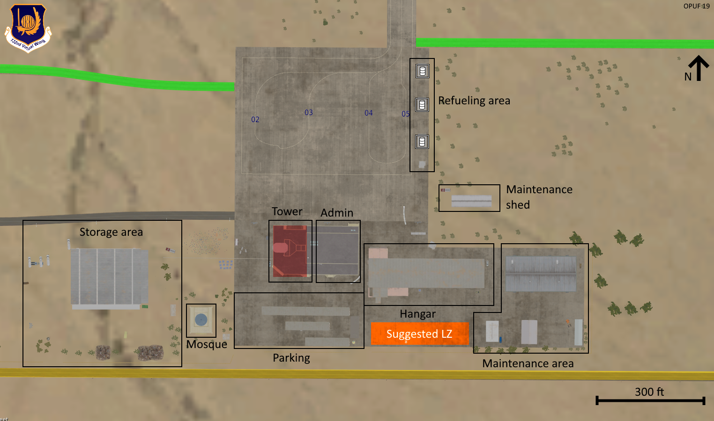
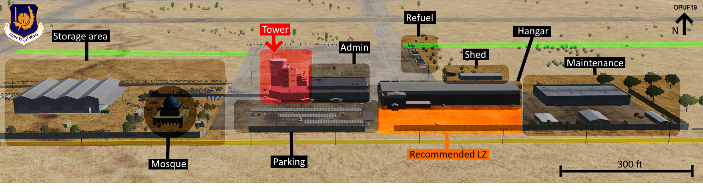
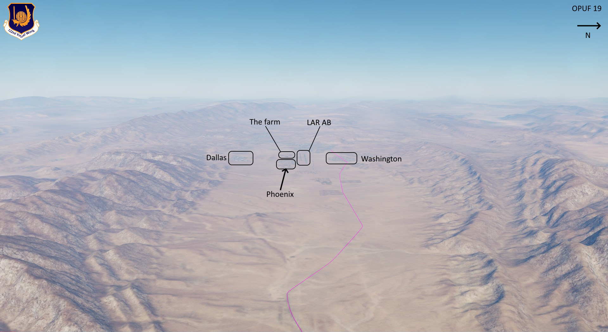
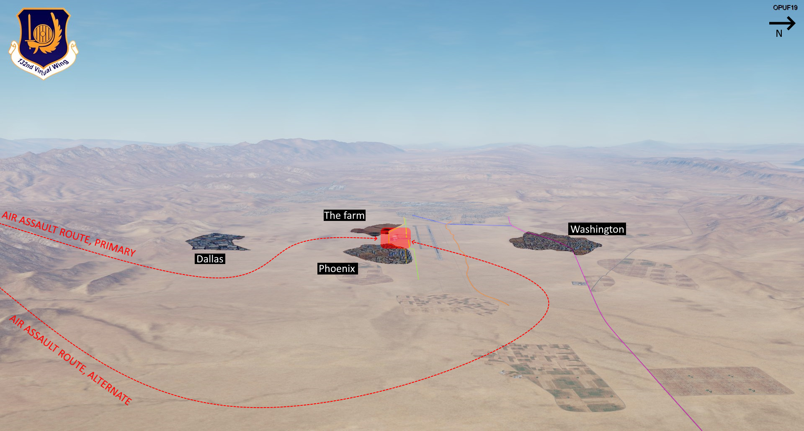
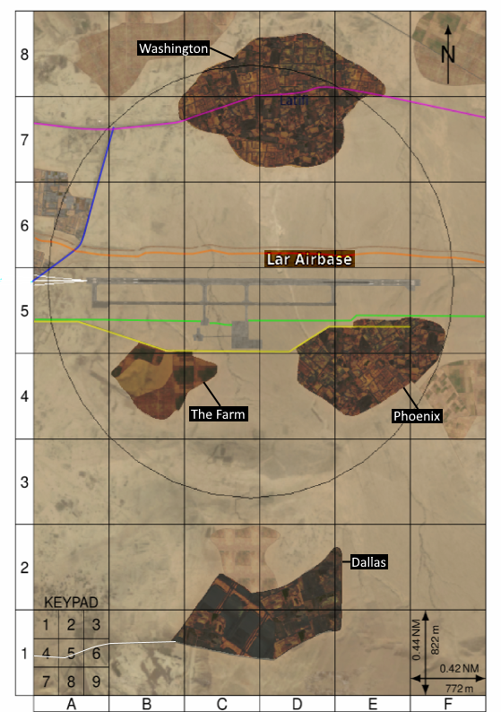
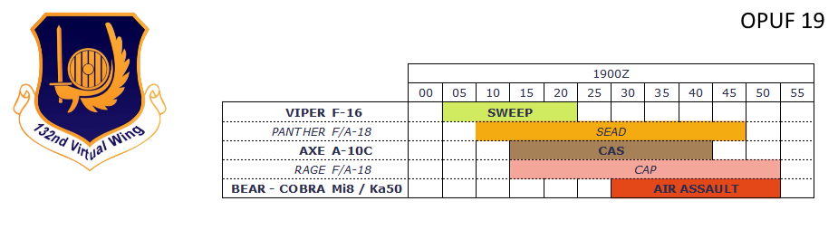

# OPUF19 FRAGO AIR ASSAULT LAR

Edition: DRAFT 3

Publishing agency JTAC VIKING

Reference: https://132nd-vwing.github.io/OPUF-Brief/

## CHANGES

UPDATE 021600Z APR 20, DRAFT 3: integrate PANTHER SEAD flight and expand gameplan

UPDATE 021413Z APR 20, DRAFT 2: add SAM threat from INTEL

DRAFT 1: initial release

## Weather/terrain

Local time 0300.

Calm wind from East, clear skies.

Terrain:

* 7200 feet NE of Lar AB.
* 6500 feet South of Lar AB

## TASKORG

|   c/s  |           assets           |            mission            |
|:------:|:--------------------------:|:-----------------------------:|
| BEAR   | 1xMi8 (!)                  | Air assault LAR AB            |
| COBRA  | 3xKa50                     | Escort BEAR                   |
| VIKING | SOF platoon on the ground  | Support air assault           |
| VIPER  | 4xF-16                     | Sweep area prior air assault  |
| AXE    | 2xA-10C                    | Shaping CAS                   |
| RAGE   | 3xF/A-18                   | TARCAP in support air assault |
| PANTHER | 2xF/A-18                  | SEAD |

## Situation

JTAC VIKING currently in transit, limited INTEL available for AO.

All units to refer to their respective S2 for information.

### UPDATE 021413Z APR 20

Preliminary intel indicates likely presence of AAA in close protection of airfield:

* ZU23
* Shilka
* Tungunska

Following destruction of SA6 in the past days, it is likely the area will be protected by SA15 and/or SA11.

### UPDATE 021600Z APR 20

VIKING waiting on BEAR for final coordination.

## Mission

Conduct air assault on Lar AB.

## Execution

### Setup

PANTHER flight will establish holding area South of Lar AB, 10 to 20nm, above 5000ft (not in the picture).

AXE flight will establish holding area Elisa, East of LAR AB, 10 to 20nm, above 5000ft AGL. 

BEAR / COBRA flights to set-up holding area Selene, south of LAR AB, behind the ridge, exact position at discretion BEAR FL.

### Shaping

VIKING will arrive at AO at 1800Z and start gathering intel on enemy disposition.

Upon arrival PANTHER and AXE, VIKING will transmit target coordinates and provide a framework for engagement.

Attacks on target will be loosely controlled until codeword SPRING BREEZE (air assault start).

AXE flight to conduct all attacks from East to West, egress left turn to the East, unless otherwise stated in CAS brief.

PANTHER flight to conduct all attacks from South to North, egress right turn to the South, unless otherwise stated in CAS brief.

Deconfliction AXE / PANTHER will be VIKING.

Start of air assault will be postponed (codeword MONSOON RAIN) until PANTHER and AXE have satisfactorily sanitized the AO.

#### Target priorities during shaping

Target priority will be as follows:

* SAM units:
  * SA11
  * SA15
  * SA19
  * AAA
* enemy units closest to planned LZ

In addition, PANTHER and AXE flights may consider planning mutual support plan to increase effectiveness of SEAD during shaping.

### Air assault

Initial suggestion VIKING.

At start of air assault (codeword SPRING BREEZE), AXE flight to establish a East-West orbit in such a way that at least one member of the flight will always be facing towards the LZ, in such a position that said member of the flight will be able to react promptly should BEAR encounter resistance (adjust spacing accordingly). Should BEAR flight encounter resistance during the assault, AXE flight is to tip-in, announce tipping in and describe its target; VIKING will clear or abort the attack.

At start of air assault (codeword SPRING BREEZE), PANTHER flight to establish a South-North orbit in such a way that at least one member of the flight will always be facing towards the LZ, in such a position that said member of the flight will be able to react promptly should BEAR encounter resistance. Should BEAR flight encounter resistance during the assault, PANTHER flight is to tip-in, announce tipping in and describe its target; VIKING will clear or abort the attack.

COBRA flight will be under direct control of BEAR during the ingress phase (from codeword SPRING BREEZE to codeword MORNING DEW) and will assume WEAPONS FREE posture.

### Egress

Once friendlies are on the ground (codeword MORNING DEW), COBRA is to conclude pending engagements then resume WEAPONS TIGHT posture.

Once friendlies are on the ground (codeword MORNING DEW), AXE flight and PANTHER flight are to resume assigned holding area for further tasking (if any).

### Reconnaissance

Satellite view of the LZ:

Following pictures were taken this morning by MQ-9 drone.

### Kneeboard GRG

## Timeline

## Service support

RAGE flight will be flying in direct support of air assault 60nm NE of Lar AB.

## Command/signal

### Commplan

**Primary frequency: 119.250 (RED 11)**

Main frequency for check-in and air assault.

**CAS frequency 33.50 (BROWN 4)**

To be used during BIREF and ATTACK by all assets supporting air assault except for COBRA (COBRA is to stay on primary frequency at all time).

### CODEWORDS

| Codeword | Meaning |
| ---| --- |
| HEAT WAVE	| abort(ing) air assault, egress(ing) area
| SPRING BREEZE	| start(ing) air assault	
| MORNING DEW	| boots on the ground	
| MONSOON RAIN |	air assault ROLEX 5m (can be used multiple times)
| NIGHT DRIZZLE |	switch(ing) to alternate air assault route	

### C2

TACON AO with JTAC VIKING on primary frequency at all times.

BEAR flight has authority for starting/aborting air assault.

COBRA flight TACON will be delegated to BEAR.

In case VIKING cannot be contacted BEAR has TACON AO.

In case both VIKING and BEAR flight cannot be contacted all flights are to egress AO and contact DARKSTAR.

### Contact point

BEAR flight to contact JTAC VIKING at earliest possibility (with COBRA attached and assembled).

All other flights to contact JTAC VIKING NLT 40nm out of Lar AB.

## Loadouts

Loadout at discretion FL.

VIKING recommends maximizing agility and standoff capabilites.

